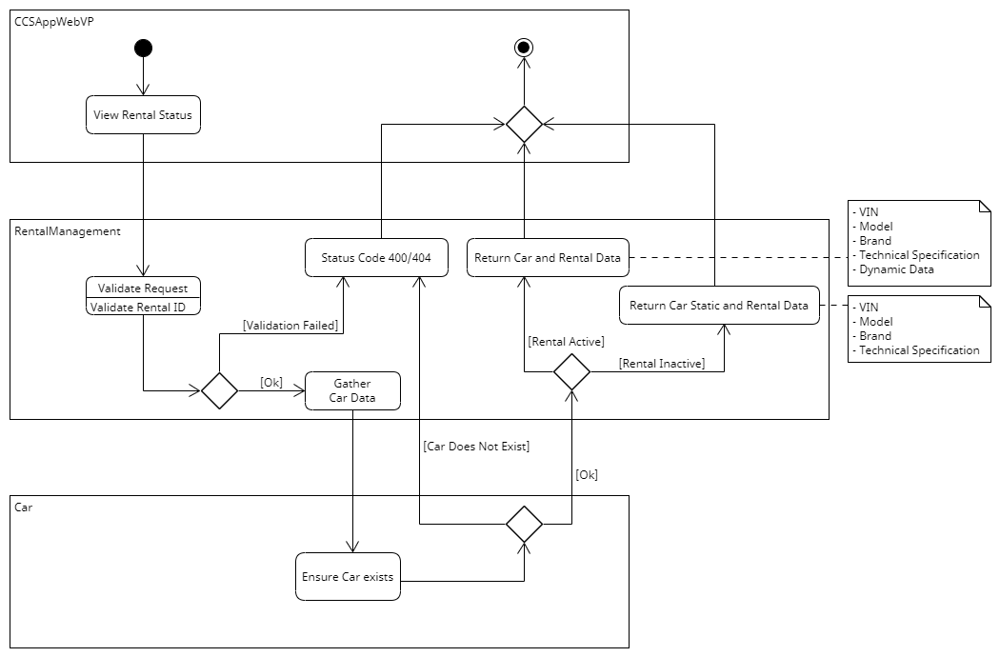
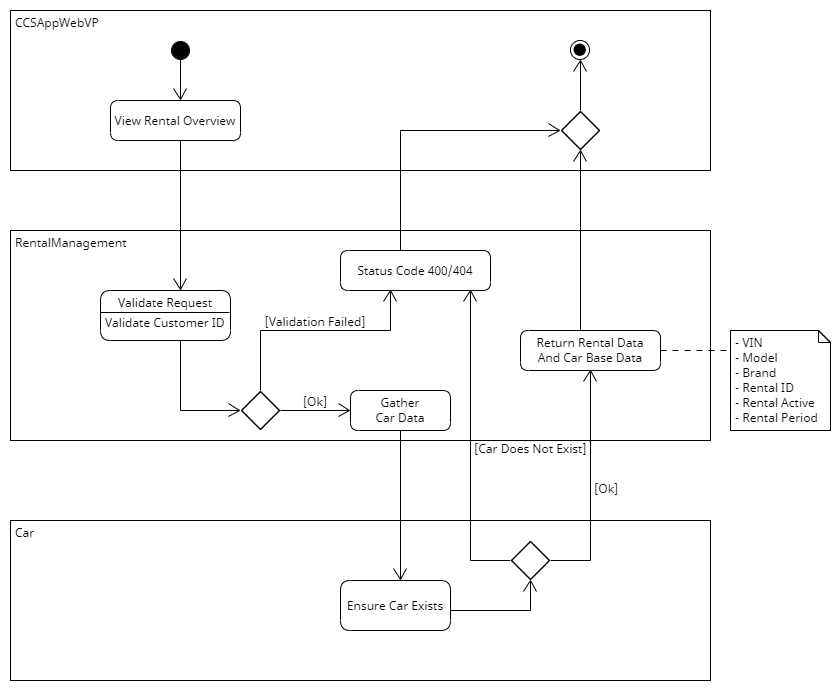
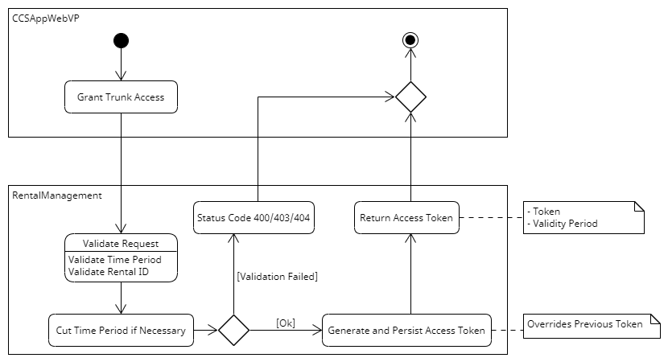

# Task Processes

## Management of the Rentals

### View Rental Status (see [Use Case "View Rental Status"](https://github.com/ccsapp/docs/blob/main/pages/use_case_view_rental_status.md))

### View Rentals Overview (see [Use Case "View Rentals Overview"](https://github.com/ccsapp/docs/blob/main/pages/use_case_view_rentals_overview.md))

### Create Car Rental (see [Use Case "Create Car Rental"](https://github.com/ccsapp/docs/blob/main/pages/use_case_create_car_rental.md))

### Grant Trunk Access (see [Use Case "Grant Trunk Access"](https://github.com/ccsapp/docs/blob/main/pages/use_case_grant_trunk_access.md))

### Change Trunk Lock State (see [Use Case "Change Trunk Lock State"](https://github.com/ccsapp/docs/blob/main/pages/use_case_change_trunk_lock_state.md))

